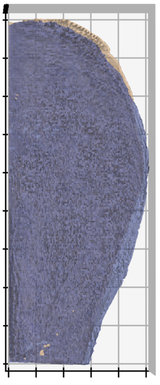
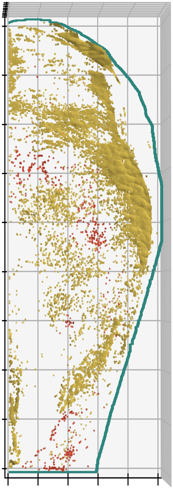
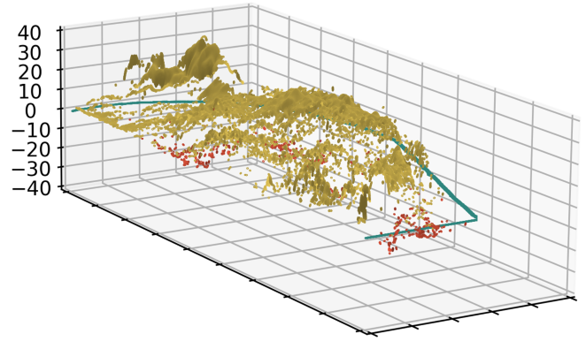

# __Plot tissue asymmetry__
## __Overview__
--------

Quantifies and plots 3D posterior neural fold asymmetry in confocal images of mice embryos.

| **Unprocessed PNP & Distance Map**  | **Median differences of both WT and MT embryos** | **Median difference image rotated** | **Areas in which there is significant asymmetry** | **Significant asymmetry image rotated** |
| --- | --- | --- | --- | --- |
|  |  |  |  |  |


version number: 1.0.1
author: Henry Crosswell

----------------------------------

## __Usage:__
---
Disclaimer: 
This technique has only been tested on confocal images of the posterior neural folds of E9 mice. 


## Step 0
To prepare the images before analyse, the following [macros](https://github.com/HenryCrosswell/Asymmetry_Macros) must be used on ImageJ.

Images must all be resized within the same dimensions.

## Step 1
Create a new folder and place all images to be quantified within.
Create another new folder, this will be where your plots are saved.

### Image naming conventions:
- Wild-type embryo images must begin with "WT image".
- Excluded images must begin with "CF+ image".
- Other included images can remain unspecified

## Step 2 - Installation
Install the scipt!

1. Create a conda environment, with the dependencies listed in [environment.yml](https://github.com/HenryCrosswell/asymmetry_python).
```
conda env create
```
2. A new conda environment named `asymmetry`, which will be activated before use:
```
conda activate asymmetry
```
3. Install `plot_tissue_asymmetry` next.
```
pip install plot_tissue_asymmetry
``` 

## Step 2.5 - customise main.py
Within the main.py file, you can customise the elevation and azimuth of your final plots.
//could also be prompted in terminal so this editing script isn't necessary

## Step 3 - Run the script
From your terminal, type: 
```
python main.py
```

## Step 4
Now follow the steps prompted by the terminal.
1. It will first ask you to select a folder, make sure to select the folder with the pre-named images within.
2. Next it will ask for an output folder for your saved images, select the one created earlier.

## Contributors
------------

Dr. Alessandro Felder 

